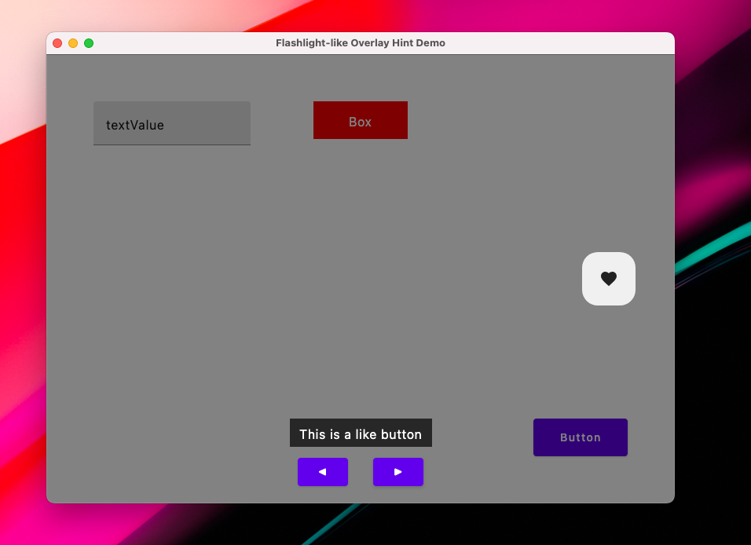

# Flashlight Overlay Compose Desktop Demo

A small Kotlin Compose Desktop sample app that shows how to spotlight (flashlight) individual UI components by darkening the rest of the window with a semi‑transparent mask and cutting out a padded, transparent “hole” over the target. Cycle through multiple targets with ◀/▶ controls, and display per‑target hint text at the bottom.

---

## Screenshots

<p align="center">
  
  
</p>

---

## Description

This repo contains:

- **Private helpers** (`captureBoundsInRoot`, `FocusOverlay`) for measuring and masking.
- A **unified** `FlashlightDemoUnified()` composable demonstrating:
    - Four different UI targets: Button, TextField, Box, IconButton.
    - A full‑screen 50%‑black overlay with a 3 dp padded hole over the selected target.
    - Bottom‑center hint text and ◀/▶ navigation.
- A `main()` entry point via `singleWindowApplication`.

Ideal as a drop‑in example for tutorials, tooltips, onboarding overlays, or any “spotlight” effect in a desktop Kotlin Compose app.

---

## Getting Started

```bash
# Clone the repo
git clone https://github.com/your‑username/compose‑flashlight‑demo.git
cd compose‑flashlight‑demo

# Build & Run
./gradlew run
